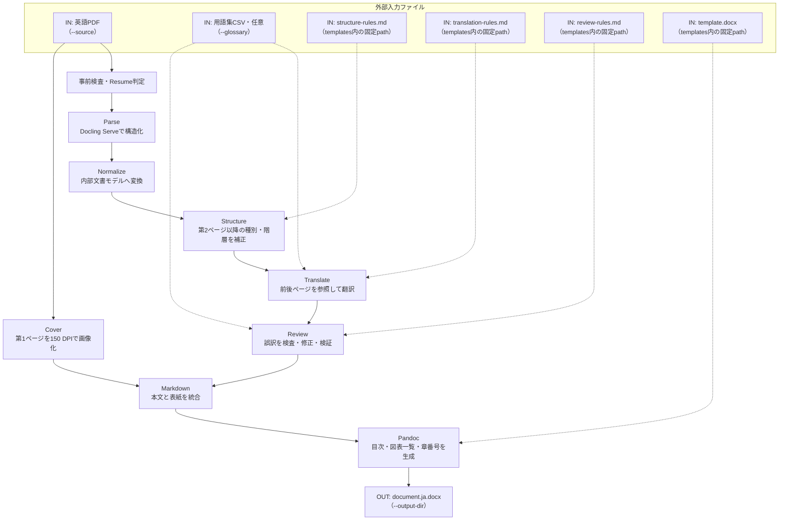
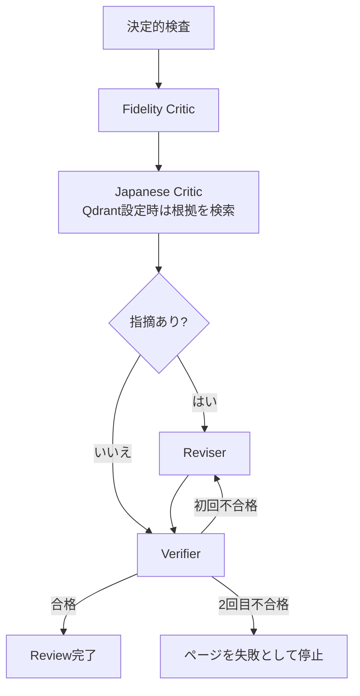

# translate-ja-v5

`translate-ja-v5`は、英語PDFを解析・翻訳・Reviewし、日本語DOCXを生成するPythonユーティリティです。Agent Skillではなく、コマンドラインから実行します。

主な機能は次の3つです。

- `translate`: 英語PDFから日本語DOCXを生成する
- `review`: 既存の英語PDFと日本語PDFを比較し、`review.md`を生成する
- `register`: Reviewで参照する文書をQdrantへ登録する

翻訳では、翻訳の正確さ、構造保持、実行コスト、見た目の順に品質を優先します。PDFの紙面をそのまま再現するのではなく、文書構造を保った編集可能なWord文書を生成します。

## 必要な環境

### 実行ツール

- Python 3.12以上
- [uv](https://docs.astral.sh/uv/)
- Pandoc
  - `--list-of-figures`
  - `--list-of-tables`
  - `--number-sections`
  - `docx+native_numbering`

repository rootでPython依存関係を同期します。

```bash
uv sync --all-groups
```

v5が使用する主なPythonパッケージは次のとおりです。バージョン条件はrepository rootの`pyproject.toml`を正本とします。

| パッケージ | 用途 |
|---|---|
| `typer` | CLI |
| `httpx` | Docling Serve、LibreTranslateなどのHTTP通信 |
| `openai` | LiteLLMのOpenAI互換API呼び出し |
| `pydantic` | 内部文書モデルと応答の検証 |
| `portalocker` | 出力directoryの多重実行防止 |
| `pypdfium2` / `Pillow` | PDF本文抽出とページ画像生成 |
| `langgraph` | Reviewの分岐と再修正フロー |
| `langfuse` | 任意のLLMトレース記録 |
| `qdrant-client` | 任意のReview根拠検索と文書登録 |
| `python-dotenv` | `.env`の読み込み |
| `typing-extensions` | Review状態の型定義 |

### 外部サービス

`translate`には次のサービスが必要です。

- Docling Serve: PDF/DOCX/PPTXを構造化JSONへ変換する
- LiteLLM: vLLM上のQwen/GemmaなどをOpenAI互換APIとして呼び出す

次のサービスは任意です。

- LibreTranslate: 翻訳backendの代替
- Langfuse: 実行、LLM入出力、Reviewを記録
- Qdrant: Review用の参照検索と参照文書の保存

接続確認例です。

```bash
curl "$OPENAI_BASE_URL/models" \
  --header "Authorization: Bearer $OPENAI_API_KEY" | jq

curl "$QDRANT_URI/collections" \
  --header "api-key: $QDRANT_API_KEY" | jq
```

## 最小設定

`.env`などへ次を設定します。

```dotenv
DOCLING_SERVER_URL=http://docling.example.test
OPENAI_BASE_URL=http://litellm.example.test/v1
OPENAI_API_KEY=replace-me
OPENAI_STRUCTURE_MODEL=structure-model
OPENAI_TRANSLATION_MODEL=translation-model
OPENAI_REVIEW_MODEL=review-model
```

Qdrant、Langfuse、LibreTranslateの設定は、該当機能を使用する場合だけ必要です。Langfuseのページ画像uploadは無効です。

## 翻訳の実行

repository rootから実行します。

```bash
uv run python scripts/translate-ja-v5/translate.py translate \
  --source inputs/source.pdf \
  --output-dir outputs \
  --backend openai
```

処理を最初からやり直す場合は`--force`、APIやfileを変更せず実行予定だけを見る場合は`--dry-run`を指定します。

```bash
uv run python scripts/translate-ja-v5/translate.py translate \
  --source inputs/source.pdf \
  --output-dir outputs \
  --backend openai \
  --force
```

## 翻訳処理の流れ



フローチャートの`IN`と`OUT`は、利用者が直接指定または利用するファイルだけを示します。Rulesと`template.docx`は同梱ファイルを自動で取り込むため、指定用CLIオプションはありません。Resume用の中間成果物は後述の「出力」を参照してください。

### 事前検査・Resume判定

Pandocの必要機能、入力PDF、必須環境変数を検査します。`.work/state.json`があれば完了済みページを再利用します。用語集の追加・削除・内容変更時はTranslate以降を再実行します。入力PDFのhashが変わっている場合は、誤ったResumeを防ぐため停止します。

### Parse

PDFを最大10ページずつDocling Serveへ送り、text、見出し、list、表、画像、数式などを持つDocling JSONを取得します。分割結果のページ番号、参照ID、画像pathを全体文書用に再構成し、`.work/parsed.json`へ保存します。

### Normalize

Docling固有の大きなJSONを、`Document`、`Page`、`Block`、`Inline`を中心とするv5内部モデルへ変換します。順序、座標、見出し階層、list、table cell、caption、link、文字装飾を保持し、`.work/normalized.json`へ保存します。内容を持つ未知要素は黙って捨てず、エラーにします。

### Structure

ページ画像と正規化済みブロックをStructure modelへ渡し、見出し、本文、引用、listなどの種別や階層を補正します。本文そのものは変更せず、結果をページ別JSONとして`.work/structured/`へ保存します。ルールは`templates/structure-rules.md`から読みます。

### Translate

対象ページの各Inline IDを保ったまま日本語へ翻訳します。前後1ページの原文は文脈として参照しますが、出力するのは対象ページだけです。URL、path、command、codeなどの保護文字列や、入力IDの欠落・混同を検査します。結果は`.work/translated/`へ保存します。

翻訳方針は`templates/translation-rules.md`、任意の8列用語集は`--glossary`で指定します。用語集は`english-short,english-long,japanese-short,japanese-long,kind,description,note,reference`列を持ち、各promptには対象原文へ実際に出現する用語だけを含めます。`--backend libretranslate`を選んでも、StructureとReviewはLiteLLMを使用します。

### Review

各翻訳単位を次の順に直列処理します。



決定的検査は数値、単位、URL、識別子、用語集などの保持を確認します。Fidelity Criticは意味の欠落や追加を、Japanese Criticは用語、一貫性、自然さを確認します。Reviserだけが訳文を変更し、Verifierが原文と修正版を直接比較して合否を決めます。2回目のVerifierも不合格なら、そのページを失敗として停止します。結果は`.work/reviewed/`へ保存します。

Reviewルールは`templates/review-rules.md`から読みます。

### MarkdownとDOCX

Review済みの内部モデルから、見出し、list、表、画像、caption、footnoteなどをPandoc Markdownへ変換します。PDF第1ページは150 DPI相当の表紙画像として先頭へ追加し、翻訳本文からは除外します。

最後にPandocへMarkdownと`templates/template.docx`を渡し、目次、図表一覧、章番号を含むDOCXを生成します。独自のOOXML後処理は行いません。

## 出力

```text
outputs/<source-stem>/
├── document.ja.docx
└── .work/
    ├── state.json
    ├── run.lock
    ├── parsed.json
    ├── normalized.json
    ├── structured/
    ├── translated/
    ├── reviewed/
    └── document.ja.md
```

公開成果物は`document.ja.docx`です。`.work/`以下はResume用の内部成果物ですが、問題調査にも使用できます。

## その他のコマンド

既存の英語PDFと日本語PDFを比較します。

```bash
uv run python scripts/translate-ja-v5/translate.py review \
  --source source-en.pdf \
  --destination translation-ja.pdf \
  --output review.md
```

Review参照文書をQdrantへ登録します。

```bash
uv run python scripts/translate-ja-v5/translate.py register --doc-path reference.pdf
uv run python scripts/translate-ja-v5/translate.py register --doc-dir references/
```

PDF、DOCX、PPTXは既存のDocling Serve処理でParseし、内部文書モデルへNormalizeします。見出しと段落の境界を優先し、約1,000 tokenごとに約100 tokenを重複させます。巨大な意味blockは本文を分割し、継続chunkへ見出しを再掲します。MarkdownとUTF-8 textにも同じchunk化規則を適用し、Embeddingは一件ずつ、Qdrantのupsertと登録確認は64件ずつ直列送信します。設定したQdrant collectionが存在しない場合は、最初のEmbedding次元とCosine距離で自動作成し、存在する場合は文書を追加します。同じsourceを再登録した場合は、検証後に旧revisionと同一revisionの余剰pointを削除します。

環境変数、Resume条件、Rules、制約の詳細は[利用者向けドキュメント](../../docs/translate-ja-v5.md)を参照してください。Docling JSONから変換する型の詳細は[内部文書スキーマ](docs/internal-document-schema.md)に記載しています。
