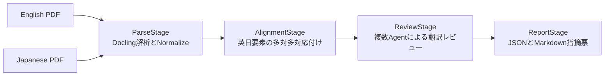

# review-enja仕様

## Workflow



Stage順は `ParseStage → AlignmentStage → ReviewStage → ReportStage` とする。

### ParseStage

同じ `skills/` 配下の `translate-ja-v4`からParseStageとNormalizeStageを再利用する。英日PDFをそれぞれ既定10ページに分けてDocling Serveへ送り、対応schema・必須field・参照を検証してから連結する。`include_page_images=false`、`images_scale=1.0` とし、ページ画像はローカル生成する。NormalizeStageはheader/footer、図中文字、目次系ページ、読み順と断片を補正する。

### AlignmentStage

normalized Docling JSONの本文、見出し、表題、`grid` / `table_cells` / `cells` の表セルを読み取る。code、header、footerは対象外とする。英日要素を全文中の累積文字位置でbatch候補へ分け、LLMが原文ID配列と訳文ID配列だけを多対多で対応付ける。LLMが本文を返しても採用せず、検証済みIDからローカルJSON本文を結合する。

IDは別々に解析された2文書を曖昧なく対応付け、欠落・重複・順序変更を検出するために必須である。全IDが入力順にちょうど1回現れない応答は失敗とし、batchを要素境界で二分する。片言語だけの最小単位は `source_only` または `translation_only` として保持する。

### ReviewStage

Fidelity ReviewerとTerminology ReviewerをLangGraphで並列実行する。両者のstatus、severity、category、修正案が一致すればそのまま採用し、不一致だけをAdjudicatorへ送る。原文、現在訳、ページ、一致した用語集、任意のQdrant根拠をpromptへ含める。

用語集schemaは `english-short,english-long,japanse-short,japanese-long,kind,description,note,reference` とする。検索対象は英語2列で、promptから `note` と `reference` を除く。品質判断は `--review-rules` の外部ファイルへ置き、組み込みpromptは役割、外部ルール遵守、出力schema、ID完全性だけを指定する。

`source_only` はomission、`translation_only` はadditionとしてLLMなしでmajor判定する。レビュー結果は訳文PDFやDocling JSONを上書きせず、Reviewer案と最終判定を `document.reviewed.json` へ残す。

### ReportStage

重大度件数、Pass・要修正件数と、要修正項目の原文、現在訳、修正案、根拠、英日ページを `review.md` へ出力する。機械処理・監査では情報量の多い `document.reviewed.json` を正本とする。

## 出力構成

```text
outputs/review-enja/
├── source/
│   ├── <english-stem>.json
│   ├── document.normalized.json
│   ├── artifacts/
│   └── manifest.json
├── translation/
│   ├── <japanese-stem>.json
│   ├── document.normalized.json
│   ├── artifacts/
│   └── manifest.json
├── document.aligned.json
├── document.reviewed.json
├── review.md
├── manifest.json
└── .langgraph.sqlite3
```

ParseとReportはStage単位、ReviewはAlignment要素単位でResumeする。Alignmentは対応関係全体の順序制約を持つためStage単位でResumeする。manifestは入力、設定、成果物のSHA-256が一致した場合だけ完成Stageを再利用する。

## LLM呼び出し回数

Alignmentの成功batch数を `A`、Reviewの成功batch数を `B`、Reviewer間で裁定が必要なbatch数を `D` とすると、通常のLLM呼び出し回数は `A + 2B + D` である。片言語だけのAlignmentはReview LLMを呼ばない。APIまたはschema検証に失敗してbatchを二分した場合、失敗試行と成功した子batchの呼び出しが追加される。

## 外部サービスと環境変数

- Docling Serve: `DOCLING_SERVER_URL`, `DOCLING_API_KEY`
- OpenAI互換API: `OPENAI_BASE_URL`, `OPENAI_API_KEY`, `OPENAI_MODEL`, `OPENAI_STRUCTURED_METHOD`
- 任意のLangfuse: `LANGFUSE_PUBLIC_KEY`, `LANGFUSE_SECRET_KEY`, `LANGFUSE_BASE_URL`
- 任意のQdrant: `QDRANT_URI`, `QDRANT_API_KEY`, `QDRANT_COLLECTION`, `QDRANT_TOP_K`, `QDRANT_VECTOR_NAME`, `OPENAI_EMBEDDING_MODEL`

対象PDFは同じ内容を同じ順序で収録している必要がある。章の並べ替えや大規模な抄訳は、相対位置によるbatch候補の前提外である。
