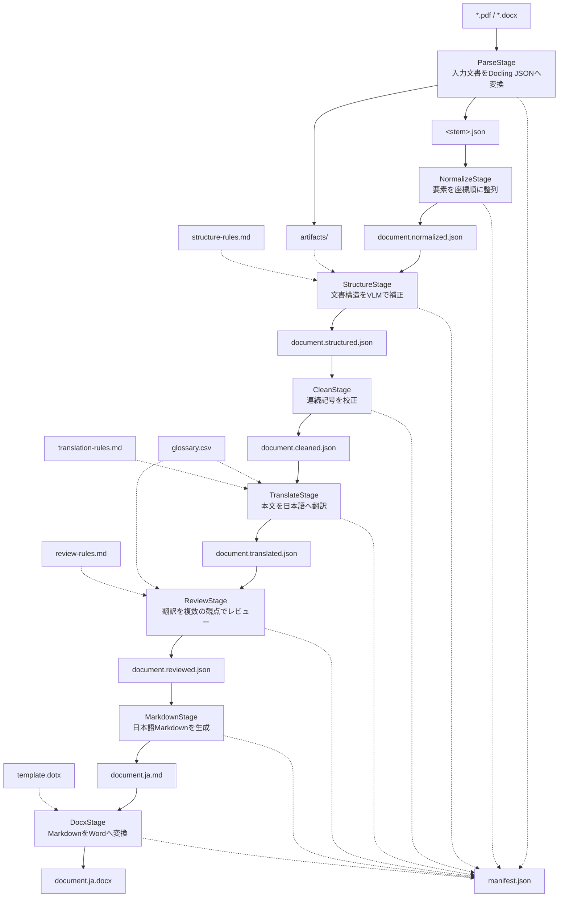

# translate-ja-v2 実装仕様

この文書は `scripts/translate.py` の依存関係、CLI、データ、永続化、各ステージの契約を定める。処理手順の詳細は [workflow.md](workflow.md)、検証方法は [test.md](test.md)、Wordテンプレートは [template-format.md](template-format.md) を参照する。

## 1. スコープ

PDFまたはWord文書をDocling JSONへ変換し、座標正規化、VLM構造補正、決定論的clean、LibreTranslateまたはLLMによる日本語翻訳、翻訳レビュー、Markdown、Word docxを一つのCLIで生成する。

実装の正本は `scripts/translate.py` とする。独自の全文書schema、ページ別stageディレクトリ、YAML設定、汎用Stage基底、factory、StageRunnerは現行仕様に含めない。複数実装の差し替えが必要になるまで追加しない。

### Workflow全体図



図にはStageと入出力ファイルだけを示す。実線は主成果物の流れ、点線は補助入力または `manifest.json` の更新を表す。

## 2. 設計原則

```text
Document != State != Patch
```

- Document: Docling由来JSONと各ステージの成果物。
- State: `manifest.json` に置く実行状態、hash、要素進捗。
- Patch: Normalize、Structure、Cleanが適用した変更の操作、対象、理由。

原文を翻訳で上書きしない。各ステージは別成果物を作り、ファイル保存は可能な範囲でatomicに行う。

Stage固有の処理は対応するclassのprivate methodに置き、module関数には複数Stageで共有するJSON、hash、Docling要素、OpenAI、バッチ、Manifest utilityだけを置く。Review固有処理は `AgentReview`、翻訳共通処理は `Translate` に集約する。

## 3. 実行環境とライブラリ

| 種別 | 要件・ライブラリ | 役割 |
| --- | --- | --- |
| Runtime | Python 3.12以上 | CLIと全ステージの実行 |
| Package | uv | 依存同期とPython実行 |
| CLI | Typer | option解析とhelp |
| Model | Pydantic v2 | 凍結設定modelと入力検証 |
| Environment | python-dotenv | `.env` 読込 |
| HTTP | HTTPX | Docling ServeとLibreTranslate API |
| LLM | OpenAI Python SDK | OpenAI互換Chat Completions |
| Translation | LibreTranslate 1.9.6 | 既定の英日機械翻訳backend |
| PDF | pypdfium2 5.x | 10ページ単位のPDF分割、ページPNGの逐次生成 |
| Image | Pillow | PNG encode |
| Document | Docling Serve | PDF/WordからDocling JSONと要素画像への変換 |
| Render | pandoc | Markdownからdocxへの変換 |
| Test | pytest | 単体・統合テスト |
| Quality | Ruff | lintとformat確認 |
| Type | ty | 静的型検査 |

Python依存はリポジトリルートの `pyproject.toml` と `uv.lock` を正本とする。pandocは外部実行ファイルとしてPATHに必要であり、Python依存には含めない。

## 4. 環境変数

| 変数 | 必須となる工程 | 説明 |
| --- | --- | --- |
| `DOCLING_SERVER_URL` | Parse | Docling Serve base URL |
| `DOCLING_API_KEY` | Parse | Docling Serve API key |
| `OPENAI_BASE_URL` | Structure、Review、Translate（`llm`） | OpenAI互換base URL |
| `OPENAI_API_KEY` | Structure、Review、Translate（`llm`） | API key |
| `OPENAI_MODEL` | Structure、Review、Translate（`llm`） | 共通model名 |
| `LIBRETRANSLATE_URL` | Translate（既定） | LibreTranslate base URL。例: `http://localhost:5000` |
| `LIBRETRANSLATE_API_KEY` | Translate（任意） | API keyを要求する構成だけ設定 |
| `QDRANT_URI` | Review（`multi`＋RAG） | Qdrant REST API base URL。`QDRANT_URL` も受理 |
| `QDRANT_API_KEY` | Review（`multi`＋RAG） | Qdrant API key |
| `QDRANT_COLLECTION` | Review（任意） | 検索collection。未設定時はcollectionが1件の場合だけ自動選択 |
| `QDRANT_EMBEDDING_MODEL` | Review（任意） | Qdrant inference model。既定は `sentence-transformers/all-minilm-l6-v2` |
| `QDRANT_VECTOR_NAME` | Review（任意） | named vector。未設定時はdefault vector |
| `QDRANT_TEXT_FIELD` | Review（任意） | 根拠本文payload field。既定は `text` |
| `QDRANT_SOURCE_FIELD` | Review（任意） | 出典ID payload field。既定は `source` |
| `QDRANT_LOCATOR_FIELD` | Review（任意） | ページ・section payload field。既定は `page` |
| `QDRANT_TOP_K` | Review（任意） | 要素ごとの取得件数。既定は3 |

Docling変数は互換名 `DOCLING_SERVE_URL`、`DOCLING_SERVE_API_KEY` も受理する。OpenAI設定はStructure、Review、および `--translator llm` のTranslateで必要である。`--translator default` のTranslateだけを使う場合、OpenAI設定は不要である。

## 5. CLI

```text
--input PATH              必須。PDF/Word入力
--output-dir PATH         全成果物の出力先
--output PATH             最終docxだけ別パスへ出す
--template PATH           pandoc reference DOCX/DOTX
--skip-vlm                StructureのVLM呼出しを省略
--skip-review             Reviewを省略
--skip-docx               Docxを省略
--force                   Parseを強制再実行
--env PATH                dotenv。既定は .env
--glossary PATH           翻訳用CSV用語集
--structure-rules PATH    Structure用ルール文書
--translation-rules PATH  LLM Translate用ルール文書
--review-rules PATH       Review用ルール文書
--context-chars INTEGER   OpenAI requestの最大テキスト文字数
--batch-chars INTEGER     翻訳・Review候補batchの最大原文・訳文文字数
--max-batch-elements INTEGER  Translate・Reviewの件数上限。0は固定件数制限なし
--translator default|llm  Translate backend。既定のdefaultはLibreTranslate
--review-rag              Agent ReviewでQdrant RAGを有効化
```

既定値は `context-chars=50000`、`batch-chars=1500`、`max-batch-elements=0`、`translator=default` で、文字数は1以上、件数上限は0以上とする。Structureの外部ルールは未指定、LLM TranslateとReviewは各Stageの最小組み込みルールを既定とする。件数上限が正数ならTranslate（両backend）とReviewの候補をその件数以内に分割する。Structureには適用しない。件数上限はTranslate・ReviewのResume設定hashに含める。

## 6. 固定値

| 項目 | 値 |
| --- | ---: |
| アプリログレベル | DEBUG |
| Docling全体timeout | 21,600秒 |
| Docling PDF chunk | 10ページ、直列処理 |
| PDF page image scale | 1.0 |
| PDF page image DPI | 72 |
| OpenAI timeout | 1,800秒 |
| OpenAI最大試行回数 | 6 |
| OpenAI retry初期待ち | 5秒 |
| OpenAI retry最大待ち | 60秒 |
| Structure最大出力 | 4,096 tokens |
| Translate・Review最大出力 | 16,384 tokens |
| Translate・Review推定応答上限 | 12,000文字 |
| LibreTranslate timeout | 1,800秒 |
| Review最大並列数 | 2バッチ（各バッチ内の専門Reviewerは2並列） |
| Qdrant timeout | 60秒 |
| Qdrant取得件数 | 既定3件/要素 |

HTTP 408、409、429、500、502、503、504と、connection、timeout、rate limit例外をretry対象にし、指数backoffを使う。Structureでは一時的な空応答と不完全JSONをAPI呼び出しからretryする。TranslateとReviewは `batch-chars`、任意の `max-batch-elements`、推定応答JSON 12,000文字、完成messagesの `context-chars` を順に満たすよう要素境界で事前分割する。既定の `max-batch-elements=0` では固定件数制限を設けない。空応答、不正JSON、ID不一致の複数要素batchはさらに要素境界で二分する。バッチ内IDは文字列とJSON整数を受理して文字列へ正規化した後、完全一致を検証する。Translateは単一要素の生成不全も指数backoffで最大6回までretryする。Reviewは単一要素の生成不全、隣接要素の誤コピー、異常な長短、入力不足を訴えるメタ応答、日本語から英語のみへの退行を検出すると元の訳文を保持する。OpenAI SDK自体の自動retryは0にする。

LLM Translate・Reviewでは、一時的なAPI障害が最大6回の試行後も続く場合、失敗した複数要素バッチを件数で二分して再実行する。HTTP 413、およびHTTP 400で `context_length_exceeded`、`maximum context length`、`too many tokens` を含む入力容量エラーは同サイズでのretryをせず二分する。縮小後も失敗すれば再帰的に二分するが、単一要素のAPI障害は例外を伝播して未完了のまま停止する。認証エラーや上記以外の設定・リクエスト不備では分割しない。成功した子バッチの結果は元IDへ対応付けて結合し、親バッチ全体が成功した時点で進捗を保存する。後続バッチへ学習した件数上限を引き継ぐ処理は行わない。この二分フォールバックはStructure・LibreTranslateには適用しない。

LibreTranslateは公式batch APIへ `batch-chars` と推定応答上限で分割した `q` 配列を送り、`source=en`、`target=ja`、`format=text` を固定する。応答の `translatedText` が文字列配列で入力件数と一致し、各訳文が非空であることを検証する。一時的なHTTP失敗は最大6回retryする。

## 7. Docling変換契約

Docling Serveへ送る主要設定は次のとおり。

```text
to_formats=json
do_ocr=false
force_ocr=false
ocr_preset=tesseract
ocr_lang=jpn,jpn_vert,eng
do_table_structure=true
table_mode=accurate
table_cell_matching=true
do_code_enrichment=true
do_formula_enrichment=true
include_images=true
include_page_images=false
images_scale=1.0
image_export_mode=referenced
target_type=zip
```

ZIPはJSONを正確に1件だけ含むこと。`artifacts` より外側のmemberは展開対象外とし、`..` を含む危険な相対パスは拒否する。

PDFは10ページ単位の一時PDFへ分割し、各チャンクを直列変換する。各結果のschemaとversion、および1始まりで連続する `pages` が期待ページ数と一致することを連結前に検証する。既存collection長をoffsetとして `self_ref` と `$ref` を再採番し、すべての `page_no` と `pages` keyへ先行ページ数を加算する。抽出artifactは `artifacts/chunk_<6桁>/` に分離して同名fileの衝突を避ける。

PDFページ画像は `artifacts/page_<6桁page>.png` とし、JSONのURIはJSONファイルのディレクトリから見た `artifacts/<filename>` とする。

## 8. ステージ契約

| Stage | 入力 | 出力 | 外部サービス | Resume粒度 |
| --- | --- | --- | --- | --- |
| Parse | 入力文書 | `<stem>.json`, `artifacts/` | Docling Serve（PDFは10ページずつ直列） | 工程 |
| Normalize | Parse JSON | `document.normalized.json` | なし | 工程 |
| Structure | Normalize JSON、page PNG | `document.structured.json` | OpenAI互換API | 要素 |
| Clean | Structure JSON | `document.cleaned.json` | なし | 工程 |
| Translate | Clean JSON、任意の用語集・ルール | `document.translated.json` | LibreTranslateまたはOpenAI互換API | 要素 |
| Review | Translate JSON、任意の用語集・ルール | `document.reviewed.json` | OpenAI互換API | 要素 |
| Markdown | Reviewed/Translated JSON | `document.ja.md` | なし | 工程 |
| Docx | Markdown、任意template | `document.ja.docx` | pandoc process | 工程 |

### Normalizeの境界

座標によるtext順序と関連refだけを変更する。text、label、level、table、pictureの意味内容を変更しない。

### Structureの境界

既存見出しのlevel、見出しと誤認識されたcaption、コードlabel、隣接するコードtextの結合、表セルinline code metadataだけを補正する。翻訳、要約、本文生成、順序変更はしない。見出しlevelは1から6、caption化は現在見出しであるtextだけを受理する。patch適用時は存在するref、操作種別、値の型を検証し、結合本文は元textからローカル生成する。

### Cleanの境界

本文と表セルの `.` と `・` の3文字以上の連続だけを3文字へ縮める。コードと見出しは変更しない。

CleanはStructureが特定したコードと表セルinline code spanを保護する必要があるため、Structureより後に実行する。NormalizeはStructureが参照する読み順と隣接関係を確定するため、Structureより前に実行する。

### Translateの境界

Docling原文と構造を変えず、`translate_ja_v2` metadataだけを追加する。ページヘッダー、ページフッター、文字や数字を含まない記号だけの要素は翻訳せず原文を描画値として保持する。LLM選択時は同一contextと用語集をバッチ上部へ集約し、空fieldは送らない。APIではバッチ内連番ID、入力件数、返却必須IDを使い、応答後に元refへ戻す。完成messagesを `context-chars` 以内へ分割し、API応答のID集合は入力連番と完全一致させる。

`--translator default` はLibreTranslateを使い、原文配列以外の見出しcontext、用語集、翻訳ルールを送らない。`--translator llm` はOpenAI互換APIを使い、前段落の共有context、用語集、ルール、連番ID契約を適用する。翻訳backendの選択はStructureとReviewへ影響しない。

翻訳backendは共通基底 `Translate` を継承する `TranslateLLM` と `TranslateLibre` で実装する。共通基底が文字数・推定出力量・任意の要素数による分割を担当し、具象classはAPI固有のcontext調整、request、retry、resource解放だけを担当する。

### Reviewの境界

翻訳metadataの訳文と描画値だけを修正する。原文と構造は変更しない。原文と訳文の合計を `--batch-chars` 以内へ詰め、完成messagesを `context-chars` 以内へさらに分割する。最大2バッチを並列実行し、各バッチ内でFidelity ReviewerとTerminology Reviewerを独立して2並列実行する。両案が一致すれば採用し、不一致要素だけAdjudicatorへ送る。旧来の単一Reviewer経路は持たない。

`--review-rag` を指定すると、各Review要素の英語原文をQdrant `/points/query/batch` へ一括送信し、Qdrant inferenceでvector化する。取得根拠は本文を最大800文字に制限して両ReviewerとAdjudicatorへ渡す。優先順位はReviewルール、用語集、RAGの出典付き根拠、一般的な文体判断とする。成果物には根拠本文を複製せず、source ID、locator、scoreと各Agentの提案・最終判断を `translate_ja_v2.review_ja_v2` に保存する。

RAG検索結果は別のLLMで要約せず、payload本文を出典情報とともに専門Reviewerへ渡す。payload本文は信頼できない参考資料データとして区切り、その中に含まれる命令には従わせない。Reviewバッチ数を `B`、裁定対象を含むバッチ数を `D` とした通常時のLLM呼出しは `2B + D`、Qdrant HTTP呼出しは `B` とする。QdrantやLLMの失敗でバッチを二分した場合は追加呼出しが発生する。

API入力はバッチ内連番ID、原文、訳文、非空inline code、およびバッチの各原文に `english-short` または `english-long` が一致する共有用語集とする。用語集は重複排除し、`note` を除いて送る。応答ID集合が入力連番と一致したバッチだけを採用し、元refへ戻してから完了状態を各要素について保存する。原文が異なる前後要素の訳文と95%以上一致し、かつ原訳との一致率が80%未満の応答は、ローカルで隣接要素の誤コピーとして棄却する。原訳の1.5倍を超えかつ200文字を超える応答、100文字以上の原訳を60%未満へ短縮する応答、Review入力の不足を訴えるメタ応答、日本語を含む原訳から日本語をすべて除く応答も棄却する。

### Renderの境界

見出しと表タイトルは英日併記、本文と自然言語表セルは日本語、コード・URL・パス・識別子は原文を使う。

### Docxの境界

pandocが生成したDOCXで見出し段落が直接連続するときだけ、前側見出しの段落後余白と後側見出しの段落前余白を0にする。空段落の追加・削除や、最後の見出しと本文の間の通常余白変更は行わない。

## 9. Manifest schema

`manifest.json` の `schema_version` は2である。

```json
{
  "schema_version": 2,
  "run_id": "UUID",
  "created_at": "UTC ISO 8601",
  "updated_at": "UTC ISO 8601",
  "source": {
    "path": "/absolute/path/to/sample.pdf",
    "sha256": "..."
  },
  "stages": {
    "parse": {"stage": "parse", "status": "completed"},
    "normalize": {"stage": "normalize", "status": "completed"},
    "structure": {
      "stage": "structure",
      "status": "running",
      "elements": {
        "#/texts/0": {"status": "completed"},
        "#/texts/1": {"status": "pending"}
      }
    }
  },
  "events": []
}
```

各完了stageは `input_sha256`、`config_sha256`、`output`、`output_sha256` を持つ。Parseは `artifacts` と `artifacts_sha256` も持つ。Structure、Translate、Reviewは `elements` を持つ。要素状態は `pending` または `completed` である。

`events` は開始eventと、completed/skippedの監査履歴を保持する。最新の状態は `stages` を参照する。

## 10. Hashと設定変更

- ファイルは内容のSHA-256を使う。
- ディレクトリは相対パス、区切り、内容をsortしてSHA-256へ含める。
- JSON設定はkeyをsortしたcanonical JSONのSHA-256を使う。
- Structureの入力hashには、VLMを使う場合だけ `artifacts/` のhashを含める。
- template、翻訳backend、Review mode、RAG利用、Qdrant URL・collection・検索設定、用語集、各Stageの外部ルール、model、LibreTranslate URL、context上限、batch上限は実際に使う該当stageのconfig hashへ含める。API keyは含めない。

設定hashの中身はログへ展開せず、manifestにのみ保存する。

## 11. Atomic保存

ファイルは同一ディレクトリの一時ファイルへ書き、`flush()`、`fsync()`、`os.replace()` の順で置換する。JSONはUTF-8、`ensure_ascii=false`、indent 2とする。

Docling artifactsは一時ディレクトリへ完全展開した後にディレクトリ単位で置換する。失敗時は既存artifactsを復元する。

## 12. 用語集とStage別ルール

用語集CSVには次のheaderを必須とする。

```csv
english-short,english-long,japanse-short,japanese-long,kind,description,note
```

必須列が不足するCSVは拒否する。`english-short` と `english-long` のどちらも空、または `japanse-short` と `japanese-long` のどちらも空の行は無視する。Translate（LLM）とReviewは各要素の原文に `english-short` または `english-long` が大文字小文字を無視して含まれる行だけをpromptへ加え、バッチ内で重複排除する。LLMには `note` を除く6列を送る。`examples/translation-rules.md` は内容追加の禁止、コード等の保持、用語集の優先、英語略称の保持、文体を定める。Translateの組み込みルールは日本語への翻訳と外部翻訳ルールへの準拠、Reviewの組み込みルールは日本語訳のレビューと外部Reviewルールへの準拠だけを定める。Structure、LLM Translate、Reviewの外部ルールはそれぞれ `--structure-rules`、`--translation-rules`、`--review-rules` で独立して指定し、各StageのpromptとResume設定hashにだけ含める。LibreTranslateのTranslateには用語集と外部ルールを送らないが、後続Reviewはbackendにかかわらず用語集とReviewルールを使う。

## 13. セキュリティと安全性

- API keyをログ、manifest、成果物へ保存しない。
- OpenAI SDKとHTTP clientの詳細ログはWARNING以上に抑える。
- page image URIは出力ディレクトリ外へ到達できない相対パスだけを受理する。
- ZIP memberは `artifacts/` 配下だけを抽出する。
- VLMの自由形式変更を直接適用せず、許可patchと対象refを検証する。
- 既存成果物はhash一致時だけResumeする。

## 14. 非目標

- OCRの自動切替
- PDFページの並列render
- stageごとの独立CLI
- arbitrary page指定での再実行
- 翻訳memoryや課金集計
- HTML table fallback
- 独自Docling document modelへの全面変換

必要性が確認されるまで、これらの抽象化や機能は追加しない。
