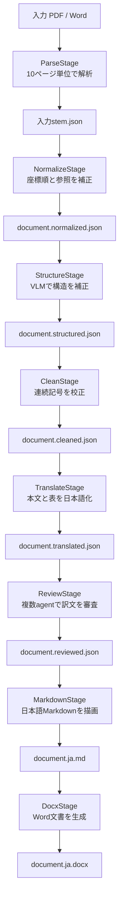

# translate-ja-v3 実装仕様

## 全体図



図はStageと入出力ファイルだけを示す。全Stageは `StateGraph` のnodeで、ReviewStageの内部だけがFidelity Reviewer、Terminology Reviewer、Adjudicatorからなるsubgraphである。

## 実行環境と依存関係

- Python 3.12以上、uv
- LangChain: prompt、LCEL、message、structured output、retriever
- LangGraph: pipeline graph、並列Review subgraph、retry、SQLite checkpoint
- `langchain-openai`: OpenAI互換Chat/Embedding model
- `langchain-qdrant`: 任意のReview RAG
- httpx: Docling Serve、LibreTranslate
- pypdfium2: PDFの10ページ分割とローカルpage image生成
- Pydantic: CLI設定とLLM出力schema
- Typer: CLI
- pandoc: Markdownからdocxへの外部変換

## LangGraph契約

共有stateはCLI設定、成果物path、直前成果物、最終完了Stageだけを持つ。大きいDocling JSONはstateへ積まず、Stage間はファイルで受け渡す。これによりcheckpointを小さく保つ。

`output-dir/.langgraph.sqlite3` はgraph-level checkpoint、`manifest.json` は成果物hashとStage-level progressの正本である。同じ入力・設定・出力先から再実行すると、LangGraphが実行履歴を保持し、各nodeはmanifestと成果物hashを検証して安全にResumeする。

## CLI契約

正本は `scripts/run_pipeline.py --help` とする。主要既定値は `translator=default`、`context_chars=50000`、`batch_chars=20000`、`max_batch_elements=0`、`LOG_LEVEL=DEBUG` である。

`--translator default` はLibreTranslate、`--translator llm` はLangChain ChatOpenAIを使う。StructureとReviewはtranslator設定に関係なくOpenAI互換APIを使う。ただし `--skip-vlm`、`--skip-review` で省略できる。

## 外部サービス契約

Docling Serveには `include_page_images=false`、`images_scale=1.0` を送り、page imageを返させない。PDFは10ページ単位で直列変換し、collection ref、ページ番号、artifact URIをローカルで再採番・連結する。全ページPNGはpypdfium2でローカル生成する。

LibreTranslateはv1.9.6互換 `/translate` の配列入力を使う。OpenAI互換APIは `OPENAI_BASE_URL`、`OPENAI_API_KEY`、`OPENAI_MODEL` を使い、Pydantic structured outputで検証する。

Review RAGは `QDRANT_URI`、`QDRANT_API_KEY`、`QDRANT_COLLECTION` を使う。collection未指定時は1件だけ存在するときに限り自動選択する。

### Qdrant Ingest

`scripts/ingest_qdrant.py` はPDF、DOCX/DOTX、Markdown、UTF-8テキスト系のfileまたはdirectoryを読み、LangChain `Document` とOpenAI互換embeddingでReview用collectionへupsertする。PDFはpage番号、全形式はsource、形式、原文SHA-256、unit番号、chunk番号をmetadataへ保存する。

point IDはsource、unit、chunk番号からUUID5で決定し、同じ入力の再実行で重複しない。`--replace-source` を明示した場合だけ、upsert成功後に同じsourceの旧SHA-256 revisionを削除する。`--dry-run` はQdrantとembedding APIを呼ばない。

既定値は `chunk_chars=1500`、`overlap_chars=200`、`batch_size=64`。IngestとReviewは同じ `OPENAI_EMBEDDING_MODEL`、`QDRANT_COLLECTION`、`QDRANT_VECTOR_NAME` を使わなければならない。

## 用語集契約

CSV headerは次の8列を完全に含む。

```text
english-short,english-long,japanse-short,japanese-long,kind,description,note,reference
```

検索対象は `english-short` と `english-long` で、大文字小文字を区別しない部分一致とする。一致行だけをTranslate（LLM）とReviewへ渡す。prompt用行から `note` と `reference` を除外する。LibreTranslateには用語集を送らない。

## Prompt契約

組み込みpromptは、担当する役割、日本語訳、外部ルールへの従属、structured output schemaだけにする。保持対象、補正範囲、忠実性、用語判断など変更可能な方針は `examples/*-rules.md` に置く。Structureは `op` と対象値を別fieldで返す正規patch形式を指示し、既知の操作名をkeyにした単一操作の短縮形式だけは同じ形式へ正規化する。VLMが返した未知操作や許可外の値は、応答全体を失敗させずローカル適用時に無視する。

Structure、Translate、Reviewはrequest失敗時に対象を要素境界で二分する。1要素でも失敗すれば例外を返し、保存済み要素は次回Resumeする。LangGraph node retryは最大2回である。

## データと安全性

JSONとmanifestは同一directoryの一時ファイルを `os.replace` してatomic保存する。artifact URIは出力directoryからの相対pathだけを許可し、absolute URI、外部scheme、`..` を拒否する。ログにsecret、prompt本文、巨大hashを出力しない。

ログ本文は英語とし、ANSI色はlevel名だけに適用する。Stage完了、skip、ResumeはINFO、pollingとrunning progressはDEBUG、縮小retryはWARNING、停止理由はERRORとする。既定DEBUGでもhttpx、httpcore、OpenAI SDKの通信内部logはWARNINGへ抑え、pipelineの進捗を埋めない。
