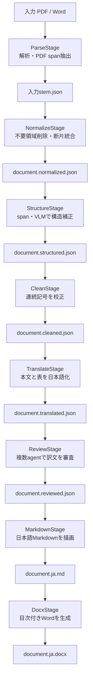

# translate-ja-v4 実装仕様

## 全体図



図はStageと入出力ファイルだけを示す。全Stageは `StateGraph` のnodeで、ReviewStageの内部だけがFidelity Reviewer、Terminology Reviewer、Adjudicatorからなるsubgraphである。

## 実行環境と依存関係

- Python 3.12以上、uv
- LangChain: prompt、LCEL、message、structured output、retriever
- LangGraph: pipeline graph、並列Review subgraph、retry、SQLite checkpoint
- `langchain-openai`: OpenAI互換Chat/Embedding model
- `langchain-qdrant`: 任意のReview RAG
- httpx: Docling Serve、LibreTranslate
- pypdfium2: PDF分割、text objectのspan抽出、ローカルpage image生成
- Pydantic: CLI設定とLLM出力schema
- Typer: CLI
- pandoc: Markdownからdocxへの外部変換

## LangGraph契約

共有stateはCLI設定、成果物path、直前成果物、最終完了Stageだけを持つ。大きいDocling JSONはstateへ積まず、Stage間はファイルで受け渡す。これによりcheckpointを小さく保つ。

`output-dir/.langgraph.sqlite3` はgraph-level checkpoint、`manifest.json` は成果物hashとStage-level progressの正本である。同じ入力・設定・出力先から再実行すると、LangGraphが実行履歴を保持し、各nodeはmanifestと成果物hashを検証して安全にResumeする。

## CLI契約

正本は `scripts/run_pipeline.py --help` とする。主要既定値は `translator=default`、`context_chars=50000`、`batch_chars=20000`、`max_batch_elements=0`、`pdf_chunk_pages=10`、`request_timeout_seconds=1800`、`max_retries=5`、`stage_max_attempts=2`、`LOG_LEVEL=DEBUG` である。API retryとLangGraph Stage retryは障害範囲が異なるため別々に調整できる。

`--translator default` はLibreTranslate、`--translator llm` はLangChain ChatOpenAIを使う。StructureとReviewはtranslator設定に関係なくOpenAI互換APIを使う。ただし `--skip-vlm`、`--skip-review` で省略できる。

## 外部サービス契約

Docling Serveには `include_page_images=false`、`images_scale=1.0` を送り、page imageを返させない。PDFは `pdf_chunk_pages` 単位で直列変換し、collection ref、ページ番号、artifact URIをローカルで再採番・連結する。全ページPNGとPDF text spanはpypdfium2でローカル生成する。

ParseStageはversion文字列を完全固定せず、`schema_name=DoclingDocument`、必須collection、body/furniture tree、連続page番号、`self_ref`、provenance、table cell形式、全ローカルJSON pointerを検証して対応schemaか判定する。chunkのschema検証失敗はDocling変換からAPI retry設定で再試行する。全chunk連結後にも入力PDFのページ数を含めて再検証する。

span schemaは `id`、`text`、`bbox`、`font`、`size`、`weight` とする。bboxは `BOTTOMLEFT` に統一し、sizeはPDF text objectのfont sizeへ変換matrixのscaleを掛けた実効値とする。Structure payloadへはDocling要素のbboxと15%以上重なる同一ページspanだけを含める。

LibreTranslateはv1.9.6互換 `/translate` の配列入力を使う。OpenAI互換APIは `OPENAI_BASE_URL`、`OPENAI_API_KEY`、`OPENAI_MODEL` を使い、Pydantic structured outputで検証する。

Review RAGは `QDRANT_URI`、`QDRANT_API_KEY`、`QDRANT_COLLECTION` を使う。collection未指定時は1件だけ存在するときに限り自動選択する。

### Qdrant Ingest

`scripts/ingest_qdrant.py` はPDF、DOCX/DOTX、Markdown、UTF-8テキスト系のfileまたはdirectoryを読み、LangChain `Document` とOpenAI互換embeddingでReview用collectionへupsertする。PDFはpage番号、全形式はsource、形式、原文SHA-256、unit番号、chunk番号をmetadataへ保存する。

point IDはsource、unit、chunk番号からUUID5で決定し、同じ入力の再実行で重複しない。`--replace-source` を明示した場合だけ、upsert成功後に同じsourceの旧SHA-256 revisionを削除する。`--dry-run` はQdrantとembedding APIを呼ばない。

既定値は `chunk_chars=1500`、`overlap_chars=200`、`batch_size=64`。IngestとReviewは同じ `OPENAI_EMBEDDING_MODEL`、`QDRANT_COLLECTION`、`QDRANT_VECTOR_NAME` を使わなければならない。

## 用語集契約

CSV headerは次の8列を完全に含む。

```text
english-short,english-long,japanse-short,japanese-long,kind,description,note,reference
```

検索対象は `english-short` と `english-long` で、大文字小文字を区別しない部分一致とする。一致行だけをTranslate（LLM）とReviewへ渡す。prompt用行から `note` と `reference` を除外する。LibreTranslateには用語集を送らない。

## Prompt契約

組み込みpromptは、担当する役割、日本語訳、外部ルールへの従属、structured output schemaだけにする。保持対象、補正範囲、忠実性、用語判断など変更可能な方針は `examples/*-rules.md` に置く。Structureは `op` と対象値を別fieldで返す正規patch形式を指示し、既知の操作名をkeyにした単一操作の短縮形式だけは同じ形式へ正規化する。VLMが返した未知操作や許可外の値は、応答全体を失敗させずローカル適用時に無視する。

Structure、Translate、Reviewはrequest失敗時に対象を要素境界で二分する。1要素でも失敗すれば例外を返し、保存済み要素は次回Resumeする。DoclingとLibreTranslateの408、409、429、5xxおよび通信障害は指数backoffでAPI retryする。LangGraph node retryの回数と間隔はPipelineOptionsで独立に設定する。

## データと安全性

JSONとmanifestは同一directoryの一時ファイルを `os.replace` してatomic保存する。ParseStageはartifactを同一filesystem上のstaging directoryへ構築し、全URIの存在確認後にdirectory単位で置換する。旧directoryはJSON保存成功まで退避し、失敗時は戻す。manifestのParse記録には相対path、size、個別hashから算出したdirectory hash、file件数、合計byte数を含め、Resume時に再計算する。artifact URIは出力directoryからの相対pathだけを許可し、absolute URI、外部scheme、`..` を拒否する。ログにsecret、prompt本文、巨大hashを出力しない。

ログ本文は英語とし、ANSI色はlevel名だけに適用する。Stage完了、skip、ResumeはINFO、pollingとrunning progressはDEBUG、縮小retryはWARNING、停止理由はERRORとする。既定DEBUGでもhttpx、httpcore、OpenAI SDKの通信内部logはWARNINGへ抑え、pipelineの進捗を埋めない。

## Normalize・Structure契約

NormalizeStageはheader/footer、picture配下の非caption text、`document_index` を含むページを削除する。削除後と並べ替え・結合後にtop-level collectionを再採番し、body、furniture、parent、childrenを含む参照を更新する。

本文・listは同一親・同一ページで、同一行、同一PDF span、または左端が揃った近接行という根拠があるときだけ結合する。終端記号で終わる本文は次段落と結合しない。既存code断片は改行で結合する。tableは同じ列数と連続座標を必須とし、gridと `table_cells` / `cells` のrow offsetを統合する。意味判断が必要な本文からcodeへの変更とcode結合はStructureStageのpatchで行う。

table cell走査は `data.grid` を優先し、gridが空または存在しない場合に `data.table_cells`、`data.cells` の順で選ぶ。flat cellのrow/columnは `start_*_offset_idx`、`row` / `col`、`row_idx` / `col_idx` の順で解決する。同じ共通iteratorをStructure、Clean、Translate、Review、Markdownが利用し、翻訳metadataは元のcell objectへ保存する。

StructureStageはVLM patch適用後、見出しlevelを1〜6に制限し、先頭をlevel 1、後続を直前から最大1段深い値へ丸める。caption誤検出、code、表セルinline codeの変更は許可されたpatchだけを適用する。

## Word後処理契約

DocxStageはpandoc生成物へ次のOOXMLだけを追加する。

- 単独の `---` 段落を `w:pBdr/w:bottom` の水平線へ変換する
- 図・表captionへ `SEQ 図` / `SEQ 表` fieldを付ける
- 文書先頭へ見出し用TOC、図用TOC、表用TOC fieldを挿入する
- `word/settings.xml` の `updateFields` を有効にする
- 連続見出し間だけbefore/after spacingを0にする

fieldの表示結果はWordなどのfield更新対応アプリで更新する。外部file参照は追加しない。

## 未継承機能（実装候補）

次は `translate-ja` または `translate-ja-v2` の実コードにあり、v4へは継承していない。v4のStage成果物・LangGraph設計と重複または方針が異なるため、自動では追加しない。

| 元実装 | 未継承機能 | v4での判断点 |
| --- | --- | --- |
| translate-ja | `run.sh` / `run.ps1` wrapper | uv CLIだけで十分か、OS別entrypointが必要か。 |
| translate-ja | Langfuse trace header | LangChain callback/tracingへ統合するか。 |
| translate-ja | 独立したchunk JSONL、page番号・見出しpath・asset参照付きchunk | 要素metadataとmanifestに加えて交換用JSONLが必要か。 |
| translate-ja | LLM streaming差分log | 機密原文がDEBUG logへ出るriskを許容するか。 |
| translate-ja | chunkごとのattempt/statusと `fallback_source` | 失敗を例外にするv4契約から原文fallbackへ変えるか。 |
| translate-ja | Markdown構文検証と警告 | MarkdownStageの生成結果へvalidatorを追加するか。 |
| translate-ja | HTML labelを独立chunkとして保持 | Docling HTML要素をMarkdownへどう描画するか。 |
| translate-ja-v2 | URL・path・identifierの保護heuristic | LibreTranslate前後の置換方式を導入するか。 |
| translate-ja-v2 | LLM出力長の事前見積り | 利用modelごとのtoken上限をCLI化するか。 |
| translate-ja-v2 | status別の細粒度retry分類 | 現在のAPI retry・batch二分をさらに分けるか。 |
| translate-ja-v2 | Qdrant payload field名とtimeoutの個別設定 | 接続先schemaの可変性が必要か。 |
| translate-ja-v2 | Structure patchごとの詳細監査記録 | manifestを進捗正本だけでなく監査logにもするか。 |

なお `translate-ja/SPEC_v2.md` の未完了checklistは実装済み機能ではないため、この一覧には含めない。
